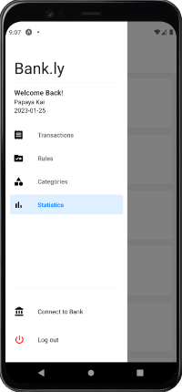
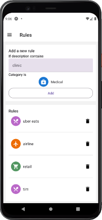

# Bank.ly Mobile
A React native application for the personal finance budgeting app Bank.ly.  

[Download .apk file here](https://drive.google.com/file/d/1dAhRUrTcO8ZXP2lOYeQpzj9CanEKtdVm/view?usp=sharing)

#### [Bank.ly Web App](https://github.com/kevban/bankly-front)  
#### [Bank.ly bank-end](https://github.com/kevban/bankly-backend)  

## What does Bank.ly do?

Bank.ly is a personal finance management tool that helps users keep track of their financial transactions and spending habits. By connecting to various financial institutions through the Plaid API, Bank.ly automatically pulls in bank transactions and allows users to easily add and edit them. Users can also create custom tags and categories to better organize their transactions and view detailed spending reports. Additionally, the app is designed to be cross-platform compatible, allowing users to access their financial information on the go.

## Usage & Key Features

- Cross platform compatible with [Bankly Web App](https://github.com/kevban/bankly-front)  

- Easily connect to various financial institutions using [Plaid](https://plaid.com/)  

- Automatically pull transactions from financial institutions  

- Categorize transactions based on user defined rules  

- Create custom transaction tags and categories  

## Technology Used
- React native, redux
- Bank API: Plaid

## Other
- This project was made for Springboard Capstone project 2
- Also see: 
    - [Bank.ly bank-end](https://github.com/kevban/bankly-backend)
    - [Bankly Web](https://github.com/kevban/bankly-front)